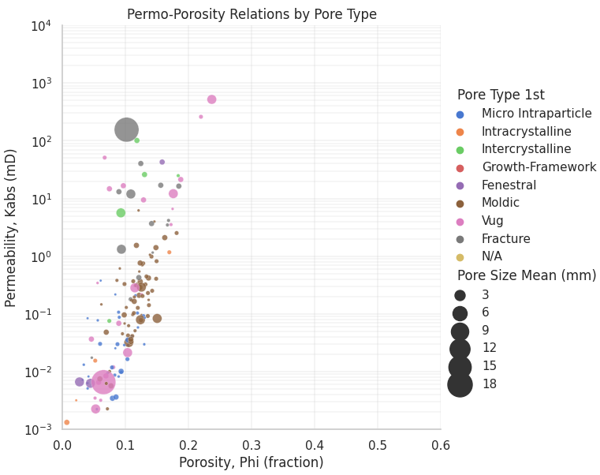
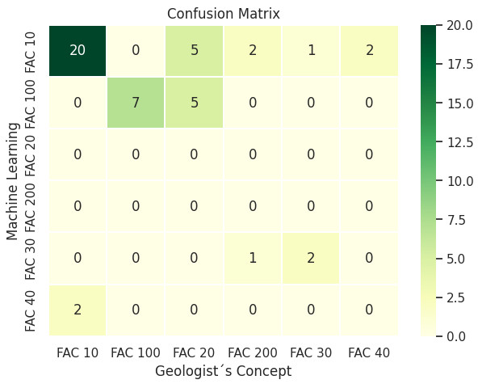
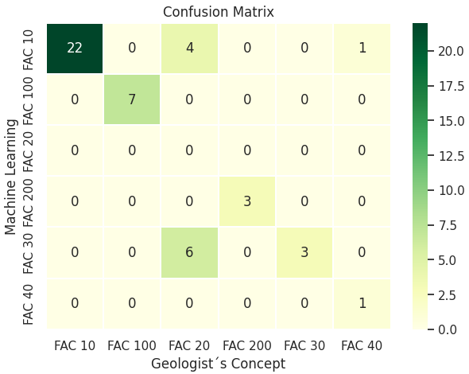

# Machine on Rocks: uso de machine learning para análise geológica e petrofísica de rocha reservatório de petróleo

#### Aluno: [João Paulo Teixeira da Fonseca](https://github.com/jpfsc).
#### Orientadora: [Dra. Manoela Rabello Kohler](https://github.com/manoelakohler).

---

Trabalho apresentado ao curso [BI MASTER](https://ica.puc-rio.ai/bi-master) como pré-requisito para conclusão de curso e obtenção de crédito na disciplina "Projetos de Sistemas Inteligentes de Apoio à Decisão".

- [Link para o código](Machine_on_Rocks.ipynb).

- Trabalhos relacionados:
    - [Bagni et al. 2022. Karstified layer and caves formed by superposed epigenetic dissolution along subaerial unconformities in carbonate rocks - Impact on reservoir-scale permeability. Marine and Petroleum Geology: 138](https://doi.org/10.1016/j.marpetgeo.2022.105523)

---

### Resumo

Lorem ipsum dolor sit amet, consectetur adipiscing elit. Proin pulvinar nisl vestibulum tortor fringilla, eget imperdiet neque condimentum. Proin vitae augue in nulla vehicula porttitor sit amet quis sapien. Nam rutrum mollis ligula, et semper justo maximus accumsan. Integer scelerisque egestas arcu, ac laoreet odio aliquet at. Sed sed bibendum dolor. Vestibulum commodo sodales erat, ut placerat nulla vulputate eu. In hac habitasse platea dictumst. Cras interdum bibendum sapien a vehicula.

### 1. Introdução

A geologia do petróleo e petrofísica são áreas com uma variedade de tipos de dados, desde textos como às descrições petrográficas (de rocha), variáveis categóricas como classes de rocha e dados numéricos como ensaios laboratoriais e perfis de poços, além de imagens 2D e 3D de rocha e perfis (Xu et al 2019 e McDonald, 2021). A análise integrada desses dados gera uma oportunidade para aplicação de técnicas de inteligência artificial e que foi bem resumido por Cuddy (2021).

Essa prova de conceito tem como objetivo aplicar técnicas de agrupamento e classificação para avaliação de rocha carbonáticas carstificadas análogas a reservatórios de petróleo com a motivação de criar grupos de rochas com características semelhantes para armazenamento de petróleo e fluxo de fluido e posterior classificação de fácies de rochas.

### 2. Modelagem

A modelagem consiste de 3 etapas descritas a seguir:

1. Condicionamento da base de dados
2. Análise Exploratória e Seleção de atributos
3. Inferência

Foi utilizado principalmente a biblioteca SciKit-Learn (Pedregosa et al, 2011), versão 1.2.2.

#### 2.1. Condicionamento da base de dados

Para esse trabalho utilizou-se de descrição petrográfica de rochas carbonáticas e análises laboratoriais de geoquímica e petrofísica básica realizadas em 157 amostras de rocha carbonática carstificada e publicadas em Bagni (2021).

A fase de extração, transformação e carga (ETL) consiste na leitura dos arquivos csv (disponibilizado na pasta _dataset_ [link](...) ), limpeza dos dados, remoção de valores nulos, filtragem, conversão de unidades, e padronização de valores categórico.

Segue a lista dos atributos selecionados e a sua descrição:

**Atributos utilizados:**
* _Sample_: categórico, código da amostra
* _Lithology_: categórico, litologia 
* _Grain Size / Crystallinity_: categórico, tamanho de grão/cristal
* _Sorting_: categórico, seleção do tamanha do grão
* _Pore type 1st_: categórico, tipo de poro principal
* _Cement 1st_: categórico, tipo de cimento principal
* _Pore Size_: categórico, tamanho do poro
* _Pore Size Mean (mm)_: numérico, tamanho do poro em milimetros
* _Pore Size Max Vug Size in plug (mm)_: numérico, tamanho do poro tipo vugular medido em plug em milimetros
* _Depositional System_: categórico, classificação do sistema deposicional
* _Main Diagenetic Environment_: categórico, classificação do ambiente diagenético
* _Microfacies_: categórico, classificação de microfácies
* _Calcite+_: numérico, teor de mineral calcite proveniente da análise geoquímica
* _Dolomite+_: numérico, teor de mineral dolomita proveniente da análise geoquímica
* _QFM+_: numérico, teor de minerais quartzo-feldspato-mica proveniente da análise geoquímica
* _Phi (fraction)_: numérico, porosidade em decimal (v/v) proveniente da análise petrofísica
* _Kabs (mD)_:  numérico, permeabilidade absoluta em miliDarcy proveniente da análise petrofísica
* _GrainDensity (g/cc)_:  numérico, média da massa específica do grão em g/cm3 proveniente da análise petrofísica

**Modelagem Petrofísica (_Petrophysical Rock-Type_, PRT)**

Foi aplicado a modelagem petrofísica conforme realizado em Bagni _et al_ (2022) para obtenção de propriedades relacionados a fácies petrofísicas com o método _Flow Zone Indicator_ (FZI) proposto por Amaefule _et al_ (1993).

#### 2.2. Análise Exploratória e Seleção de atributos

A análise exploratória dos dados mostra uma relação não linear da porosidade com a permeabilidade e FZI por isso adotou-se a correlação de Spearman (rs) para analisar o grau de dependência das variáveis.

A figura 01 mostra um gráfico de dispersão relacionando os atributos de porosidade (no X) e permeabilidade (no Y), tendo como rótulos os atributos o tipo de poro e a média do tamanho de poro como tamanho do símbolo do rótulo. Nota-se a relação não-linear forte entre porosidade e permeabilidade (rs = 0,74).

`Figura 01: Porosidade x Permeabilidade e por tipo e tamanho de poro`

**Agrupamento de Fácies Petrofísicas**

Para a modelagem de fáceis petrofísicas (_Petrophysical Rock Type_, PRT) por agrupamento foram selecionados atributos categóricas de “tipo de poro” (_Pore type 1st_) e “tamanho de poro” (Pore Size) e atributos numéricos  “porosidade” (Phi, fraction), “massa específica de grão (GrainDensity, g/cc)” e “permeabilidade” (Kabs(mD)). Esses atributos são as mais utilizadas nos métodos convencionais  (Amaefule, 1993 e Lucia, 1995). 

**Classificação de fácies geológicas**

Para a classificação de fácies sedimentares (litofácies), foram selecionados os atributos categóricas relacionados a litologia e mineralogia, tais como  “litologia” (lithology), “tamanho de grão” (GrainSize / Crystallinity), “seleção de grão” (Sorting), “tipo de cimento” (Cement 1st), e numéricas da análise geoquímica  “teor de minerais siliciclásticos" (QFM+), “Teor de calcita” (Calcite+) e "teor de dolomita” (Dolomite+).  Foi inserido o grupo de “PRT KHierarquico” definido na etapa anterior com a proposta de relacionar as classes litológicas com as fácies petrofísicas.

#### 2.3. Inferências

Foram gerados dois modelos...

**2.3.1. Modelagem dos grupos de Fácies Petrofísica (Petrophysical Rock Type, PRT)**

***Pré-processamento***

Desse modo adotou-se um fluxo de pré-processamento dos dados separando em dados categóricos, numéricos lineares e numéricos não-linear conforme o fluxo da figura abaixo.

`Figura: Fluxo de pré-processamento`

***Modelagem***

Testou-se dois tipos de algoritmo de agrupamento (clustering):

1. K-médias (Kmeans), e
2. Hieraquico aglomerativo.

A especificação do número ideal de grupos para aplicação no algoritmo de K-médias foi baseado na análise integrada das métricas:
1. Soma do quadrado das distâncias do centro dos cluster (WCSS), “análise do cotovelo”;
2. Indice de Calinski-Harabasx (1974), busco do maior valor;
3. Indice de Davies-Bouldin (1979), busca do menor valor; e
4. Coeficiente de Silhueta de Rousseew (1987), busca de valores mais próximos de +1.
   
A figura XX mostra os gráficos gerados e a identificação de número otimizado de grupos sendo 6 de modo a melhor atender os critérios. 

`Figura: Busca de melhor número de grupos para aplicação no algoritmo de K-médias`

`Quadro: Hiper-parâmetros dos modelos do modelo de agrupamento Kmeans`

Hiper-parâmetro | Modelo K-médias
---------- | ----------
N_clusters| 6
N_init  | 50
Random_state | 1
Max_iter | 500

Foi gerado outro *modelo com o algoritmo de agrupamento hierárquico aglomerativo* por ser mais flexível que o agrupamento de K-média e acomodar variáveis não numéricas e ser mais sensível na descoberta de grupos anormais (ou outliers) (Bruce & Bruce 2019).

`Quadro: Hiper-parâmetros dos modelos do modelo de agrupamento hierárquico aglomerativo`

Hiper-parâmetro | Modelo Hierarquico Aglomerativo
---------- | ----------
corte de distância (distance_threshold)| 10

**2.3.2. Abordagem para classificação de fácies**

***Pré-processamento***

O pré-processamento foi o mesmo adotado para os modelos de agrupamento.

Foi realizado uma separação entre dado de treino (70% dos dados) e teste;

Devido a número muito baixo de amostras, adotou-se uma associação de microfácies com base na descrição detalhada de Bagni (2021) e foi necessário adotar um balanceamento através do algoritmo de naive random over-sampling.

`Figura: Balanceamento das amostras para classificação`

***Modelagem***

Seleção de modelo por busca de melhores hiper-parâmetros para os algoritmos de Decision Tree e Random Forest

`Quadro: Hiper-parâmetros dos modelos de classificação`

Hiper-parâmetro   |  Decision Tree | Random Forest
--------          | -----------    | ------
Critério          | gini           |  gini
Max_depth         | 12             |  8
Min_samples_leaf  | 1              | 1
N_estimators      |                | 100

### 3. Resultados

#### 3.1. Performance dos modelos de agrupamento

`Quadro: Métricas dos modelos de agrupamento`

Métrica            | Agrupamento Kmeans | Hierárquico Aglomerativo
--------           | -------------      | ---------------
Rand Index         | 0,676              | 0,689
Homogeneity Score  | 0,242              | 0,328
Completeness Score | 0,221              | 0,205
V Measure Score    | 0,231              | 0,252

Esses parâmetros não são muitos diferentes e não ajudam muito a avaliação, portanto foi adotado a comparação de boxplots com as prpriedaes...

`Figura: Boxplot de propriedades petrofísicas por grupos gerados pelo modelo Kmeans`

`Figura: Boxplot de propriedades petrofísicas por grupos gerados pelo modelo Hierarquico Aglomerativo`

`Figura: Dendograma dos grupos gerados pelo modelo Hierarquico Aglomerativo`

`Figura: Gráfico Phi x K por grupos gerados pelo  modelo Hierarquico Aglomerativo`

#### 3.2. Performance dos modelos de classificação

`Quadro: Métricas dos modelos de classificação`

Métrica            | Decision Tree | Random Forest
-----------        | ------------  | ------------
Acurácia           | 0,681         | 0,872
Acurácia Ponderada | 0,745         | 0,895
Kappa              | 0,569         | 0,811
F1                 | 0,718         | 0,888

`Figura: Matriz de confusão do modelo Decision Tree`

`Figura: Matriz de confusão do modelo Random Forest`

`Figura: Atributos com maiores impactos no modelo Random Forest`

### 4. Conclusões

A adoção do modelo de agrupamento hierárquico aglomerativa com a integração de dados de tipo de poro e tamanho do poro (obtidos na descrição petrográfica) e dos dados de porosidade, permeabilidade e massa específica do grão (oriundo da análise petrofísica) colaborou para uma melhor definição de grupos de rocha com características permo-porosas semelhantes. 

A classificação de fácies com o método com Random Forest mostrou-se viável e ágil
O modelo com Random Forest demonstrou os melhores resultados e a aplicação é viável para propagação das fácies em amostras não classificadas e sem o viés da subjetividade de diferentes geólogos intérpretes.

Esse método tem potencial em aplicação em dados históricos dados históricos visto ser necessário apenas às descrições petrográficas e mineralógicas (e/ou geoquímicas) comumente armazenadas em forma tabular ou textual, não sendo necessário revisitar imagens 2D de lâminas petrográficas.

Vantagens dessa abordagem é poder utilizar dados categóricos e dados laboratoriais para a definição de petrophysical rock type. 

Esses dados também podem ser obtidos de análise de imagem 2D de lâminas petrográficas e volumes (3D) de micro-tomografia, sendo necessário apenas que os dados sejam discretizados em forma de tabelas (arrays).

### _Referências Bibliográficas_

Amaefule, J.O., Altunbay, M., Tiab, D., Kersey, D.G., Keelan, D. 1993. Enhanced reservoir description: using core and log data to identify hydraulic (flow) units and predict permeability in uncored interval/wells. Houston: SPE 68th annual technical conference. SPE-26436.

[Bagni, F.L. O Carste Jandaíra, Bacia Potiguar, e suas implicações para a qualidade de reservatórios. 2021. 216f. Tese (Doutorado em Geodinâmica e Geofísica) - Centro de Ciências Exatas e da Terra, Universidade Federal do Rio Grande do Norte, Natal, 2021.](https://repositorio.ufrn.br/handle/123456789/45438)

Bruce, P., Bruce, A. 2019. Estatística prática para cientistas de dados: 50 conceitos essenciais, tradução Luciana Ferraz. Rio de Janeiro: Alta Books. 320p.

Cuddy, S. 2021. The benefits and dangers of using artificial intelligences in petrophysics. Artificial Intelligence in Geoscienses (2): 1-10.

Evsukoff, A.G. 2020. Inteligência computacional: fundamentos e aplicações [[recurso eletrônico](http://www.e-papers.com.br/produtos.asp?codigo_produto=3168)]. 1ed. Rio de Janeiro: e-papers 

Lucia, F.J. 1995. Rock-fabric/petrophysical classification of carbonate pore space for reservoir characterization. AAPG Bull. (79): 1275-1300.

McDonald, A. 2021. Data quality considerations for petrophysical machine learning models. SPWLA: 62nd annual logging symposium. SPE-195068-MS.

Pedregosa, F., Varoquaux, G., Gramfort, A. Michel, V., Thirion, B., Grisel, O., Blondel, M. Prettenhofer, P., Weiss, R., Dubourg, V., Vanderplas, J., Passos, A., Cournapeau, D., Brucher, M., Perrot, M., Duchesnay, E. 2011. Scikit-learn: Machine Learning in Python. Journal of Machine Learning Research v12: 2825-2830.

Xu, C., Misra, S., Srinivasan, P., Ma, S. 2019. When petrophysics meets big data: what can machine do?. Bahrain: SPE Middle Est Oil and gas Show and Conference. SPE-195068-MS

---

Matrícula: 211.101.145

Pontifícia Universidade Católica do Rio de Janeiro

Curso de Pós Graduação *Business Intelligence Master*
